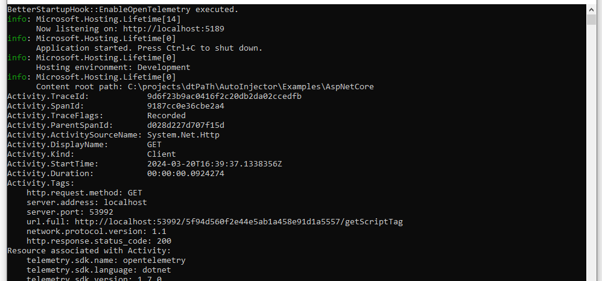

# Better Startup Hooks for .NET

## What are Startup Hooks in .NET and why do I need them

*.NET Startup hooks provide a low-level hook that allows injecting managed code to run before the main application's entry point. This hook will make it possible for the host to customize the behavior of managed applications during process launch, after they have been deployed.*

For more details read [here](https://github.com/dotnet/runtime/blob/main/docs/design/features/host-startup-hook.md) 

## Why Better-Startup-Hooks?

The low-level api for startup hooks does not include [dependency resolution for non-app assemblies](https://github.com/dotnet/runtime/blob/main/docs/design/features/host-startup-hook.md#no-dependency-resolution-for-non-app-assemblies). In other words hooks, dependencies to other assemblies than included in the injected application need extra dependency resolution logic.  

*Better-Startup-Hook allows to create startup hooks that automatically resolves additional dependencies.*

### How-does it work?
The project consists of a startup hook in ```BetterStartupHook.dll```, whichs loads the actual logic to inject into the application from other assemblies and does all the extra logic to resolve the dependencies. 

The BETTER_STARTUP_HOOKS environment variable can be used to specify a list of additional managed assemblies that contain a ```BetterStartupHook``` type with a ```public static void Initialize()``` method, each of which will be called in the order specified, before the Main entry point. 


```
using System;

internal class BetterStartupHook
{
    public static void Initialize()
    {
       //Your custom logic.. 
    }
}
```

#### Easy packaging of necessary assemblies
To simplify the packaging / management & configuration of necessary startup hook assemblies and dependencies, *BetterStartupHook* is provided as a nuget package.

[](https://www.nuget.org/packages/BetterStartupHook/)

Simply add the nuget package to your Better-Startup-Hook project, so you have all necessary assemblies in a single place - your projects output folder.   

### How-To create/use a BetterStartupHook 
#### 1. Implement your hook by creating a .Net class library project e.g. 

```
using OpenTelemetry;
using OpenTelemetry.Trace;
using System;

internal class BetterStartupHook
{
    public static void Initialize()
    {
        //Your custom logic goes here...
        Console.WriteLiine("Hello World");
    }
}
```
#### 2. Extend your .csproj to copy nuget references into your output folder

Add ```CopyLocalLockFileAssemblies``` as shown in the following

```
<Project Sdk="Microsoft.NET.Sdk">

  <PropertyGroup>
    <TargetFramework>net8.0</TargetFramework>
    <CopyLocalLockFileAssemblies>true</CopyLocalLockFileAssemblies>
  </PropertyGroup>

    ...
</Project>
```

Read more about [CopyLocalLockFileAssemblies property](https://learn.microsoft.com/de-de/dotnet/core/project-sdk/msbuild-props#copylocallockfileassemblies)

#### 3. Register your better-startup-hook assembly 
Windows:

```BETTER_STARTUP_HOOKS="<path-to-betterstartuphook>\\MyStartupHook.dll```

Linux:

```BETTER_STARTUP_HOOKS="<path-to-betterstartuphook>\\MyStartupHook.dll```

#### 4. Register the BetterStartupHook assembly as your applications startup hook. 
Windows:

```DOTNET_STARTUP_HOOKS="<path-to-betterstartuphook>\\BetterStartupHook.dll```

Linux:

```DOTNET_STARTUP_HOOKS="<path-to-betterstartuphook>/BetterStartupHook.dll```

## Examples
In the [/Examples](/Examples/) folder you find a standard Asp.Net Core example application created from Visual Studio templates. 
Additionally there is the EnableOpenTelemetryTracing project, which implements a BetterStartupHook and configures OpenTelemetry tracing exporting it's telemetry to the console. 

The Asp.Net Core Application launchSettings is pre-configured to load the hooks. 
```
{
  "$schema": "http://json.schemastore.org/launchsettings.json",
  "iisSettings": {
    "windowsAuthentication": false,
    "anonymousAuthentication": true,
    "iisExpress": {
      "applicationUrl": "http://localhost:54507",
      "sslPort": 0
    }
  },
  "profiles": {
    "http": {
      "commandName": "Project",
      "dotnetRunMessages": true,
      "launchBrowser": true,
      "applicationUrl": "http://localhost:5189",
      "environmentVariables": {
        "ASPNETCORE_ENVIRONMENT": "Development",
        "DOTNET_STARTUP_HOOKS": "$(MSBuildProjectDirectory)\\..\\..\\BetterStartupHook\\bin\\Debug\\net8.0\\BetterStartupHook.dll",
        "BETTER_STARTUP_HOOKS": "$(MSBuildProjectDirectory)\\..\\EnableOpenTelemetryTracing\\bin\\Debug\\net8.0\\EnableOpenTelemetryTracing.dll"
      }
    },
    "IIS Express": {
      "commandName": "IISExpress",
      "launchBrowser": true,
      "environmentVariables": {
        "ASPNETCORE_ENVIRONMENT": "Development"
      }
    }
  }
}
```

### Running the example
The sample application is ready-to-run and after the launch of your application you will see a initialization message from the hook and the OpenTelemetry spans details written to the console.



## Contribute
This is an open source project, and we gladly accept new contributions and contributors.  

## License
Licensed under Apache 2.0 license. See [LICENSE](LICENSE) for details.
